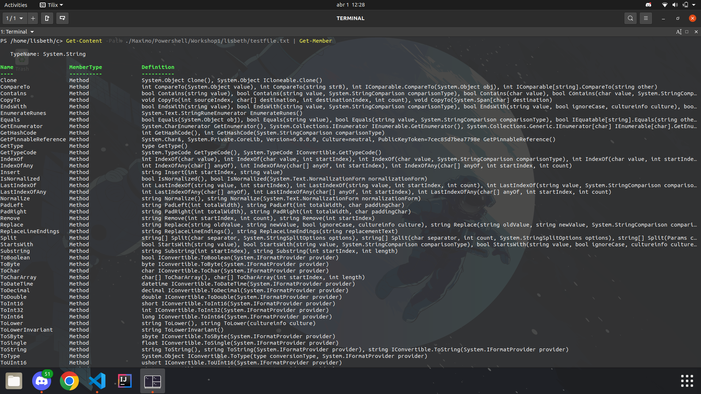
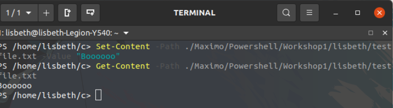
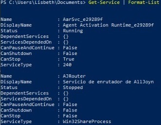
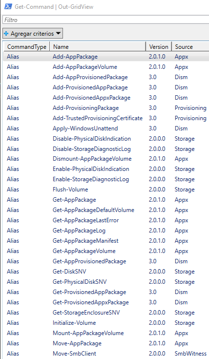
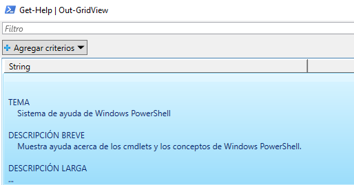
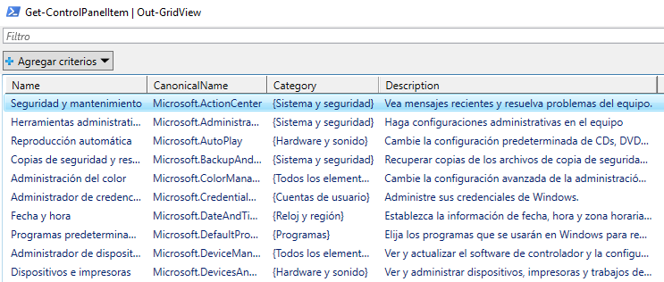
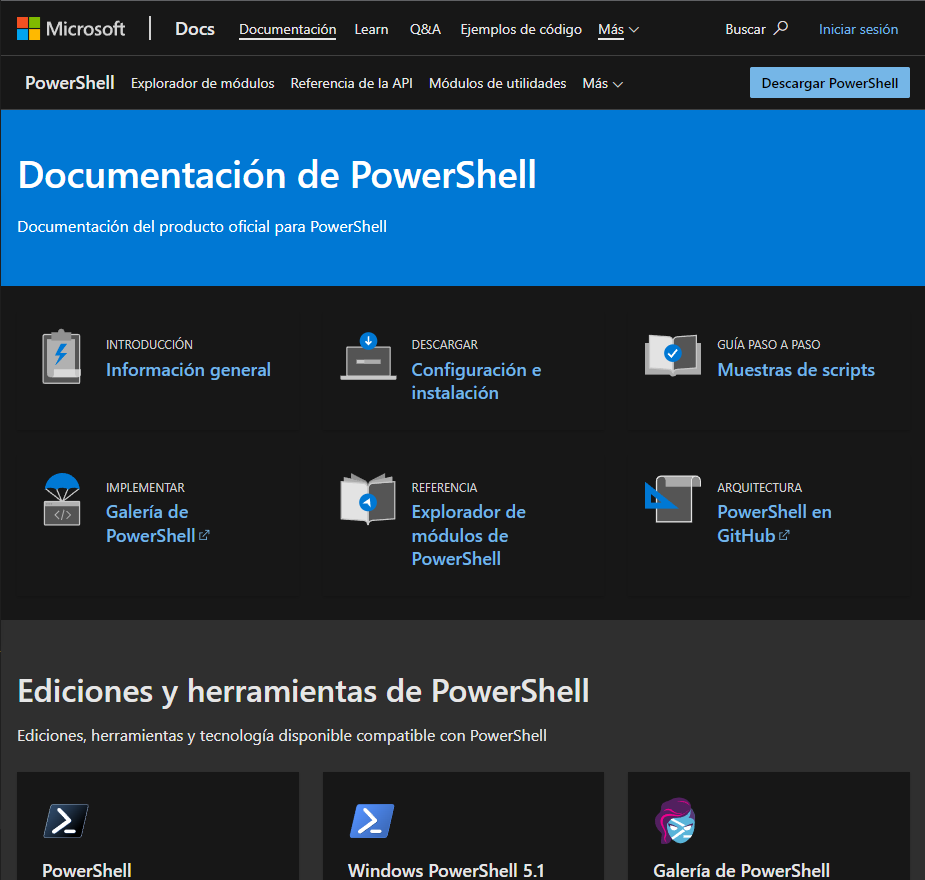

# Primitive Datatype

## Tarea 1

**Usa "Get-Help" para obtener más información sobre 5 cmdlets.**

He utilizado los siguientes cmdlets para probar `Get-Help`:

```powershell
Get-Help Get-Alias
Get-Help Get-Process
Get-Help Get-TimeZone
Get-Help Read-Host
Get-Help Copy-Item
```

Obteniendo lo siguiente:

 

---

## Tarea 2

**Use `Get-Help` con el parámetro `–Example` para el 5 cmdlets sobre los que descubrió más en la tarea 1.**

He utilizado los siguientes cmdlets:

```powershell
Get-Help Get-Error -Examples
Get-Help Get-Credential -Examples
Get-Help Get-ClipBoard -Examples
Get-Help Set-Location -Examples
Get-Help New-Variable -Examples
```

Obteniendo las siguientes salidas:

 

 Así lo que nos permite es ver ejemplos del cmdlet especificado, facilitando la comprención del mismo

---

## Tarea 3

**Cree un nuevo archivo de texto llamado `TestFile.txt` en `C:\ Maximo\PowerShell\Workshop1\%NOMBRE DE USUARIO%`**

Para ello primero creamos el directorio donde vamos a alojar el archivo con el siguiente comando:

```powershell
New-Item -Path c/Maximo/Powershell/Workshop1 -name lisbeth -ItemType Directory 
```

Para después crear el archivo:

```powershell
New-Item -Path ./Maximo/Powershell/Workshop1/lisbeth/ -Name testfile.txt -ItemType File
```

La imágen muestra la creacion del directorio y su visualización gráfica. Para después crear el archivo:


---

## Tarea 4

**Rellene el archivo de texto que creó en la tarea 3 con todos tres tipos de datos que hemos cubierto: `Boolean`, `String` e `int`**

Ejecutamos los siguientes cmdlets:

```powershell
Add-Content -Path ./Maximo/Powershell/Workshop1/lisbeth/testfile.txt -Value True 
Add-Content -Path ./Maximo/Powershell/Workshop1/lisbeth/testfile.txt -Value "Hello"
Add-Content -Path ./Maximo/Powershell/Workshop1/lisbeth/testfile.txt -Value 42
```

Después de añadir cada valor he visualizado el contenido del archivo utilizando lo siguiente:

```powershell
Get-Content -Path ./Maximo/Powershell/Workshop1/lisbeth/testfile.txt 
```


---

## Tarea 5

**Lea del archivo de texto y usa `Get-Member` para encontrar el tipo de datos devuelto**

Hacemos un `Get-Content` del archivo creado con anterioridad para mostrar las propiedades y métodos de los objetos de servicio generados por el cmdlet de `Get-Content`. Con la barra `|` recogemos la salida del anterior comando y la toma `Get-Content`. 

```powershell
Get-Content -Path ./Maximo/Powershell/Workshop1/lisbeth/testfile.txt | Get-Member 
```



---

## Tarea 6

**Sobrescriba todos los datos dentro del archivo de texto que creó en la tarea 3.**

Para sobreescribir el archivo utilizamos lo siguiente:

```powershell
Set-Content -Path ./Maximo/Powershell/Workshop1/lisbeth/testfile.txt -Value "Boooooo"
```

Y luego visualizamos el contenido del archivo:

```powershell
Get-Content -Path ./Maximo/Powershell/Workshop1/lisbeth/testfile.txt 
```

Obteniendo lo siguiente:



---

## Tarea 7

**Dar formato a los datos devueltos por un cmdlet en una lista**

El cmdlet `Get-Service` obtiene objetos que representan los servicios en una computadora, incluidos los servicios en ejecución y detenidos. Esto los recoge `Format-List` y los muestra en forma de lista.

```powershell
Get-Service | Format-List
```



---

## Tarea 8

**Capture la salida de ´Get-Command´ en ´Out-GridView´.**

```powershell
Get-Command | Out-GridView
```

Realizando este comando nos saldrá la ventana siguiente:



---

## Tarea 9

**Pipe the 5 cmdlets you discovered in task 1 into `Out-GridView`.**

He ejecutado los siguientes comandos:

```powershell
Get-Help | Out-GridView
New-Item | Out-GridView
Get-Alias | Out-GridView
Get-AuthenticodeSignature | Out-GridView
Get-ControlPanelItem | Out-GridView
```

Donde del primer comando `Get-Help | Out-GridView` he obtenido lo siguiente:



Y del comando `Get-ControlPanelItem | Out-GridView` he obtenido lo siguiente:



---

## Tarea 10

**Busca la documentacion oficial de PowerShell en Microsoft.**


La he encontrado en esta direccion web:

https://docs.microsoft.com/es-es/powershell/

