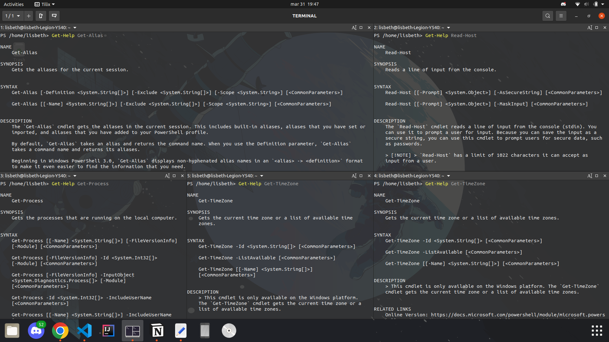
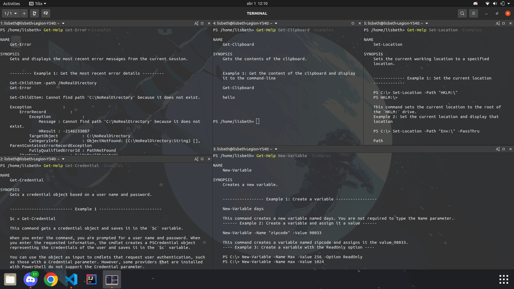

# Primitive Datatype

## Tarea 1

**Usa "Get-Help" para obtener más información sobre 5 cmdlets.**

He utilizado los siguientes cmdlets para probar `Get-Help`:

```powershell
Get-Help Get-Alias
Get-Help Get-Process
Get-Help Get-TimeZone
Get-Help Read-Host
Get-Help Copy-Item
```

Obteniendo lo siguiente:

 

---

## Tarea 2

**Use `Get-Help` con el parámetro `–Example` para el 5 cmdlets sobre los que descubrió más en la tarea 1.**

He utilizado los siguientes cmdlets:

```powershell
Get-Help Get-Error -Examples
Get-Help Get-Credential -Examples
Get-Help Get-ClipBoard -Examples
Get-Help Set-Location -Examples
Get-Help New-Variable -Examples
```

Obteniendo las siguientes salidas:

 

 Así lo que nos permite es ver ejemplos del cmdlet especificado, facilitando la comprención del mismo

---

## Tarea 3

**Cree un nuevo archivo de texto llamado `TestFile.txt` en `C:\ Maximo\PowerShell\Workshop1\%NOMBRE DE USUARIO%`**

Para ello primero creamos el directorio donde vamos a alojar el archivo con el siguiente comando:

```powershell
New-Item -Path c/Maximo/Powershell/Workshop1 -name lisbeth -ItemType Directory 
```

Para después crear el archivo:

```powershell
New-Item -Path ./Maximo/Powershell/Workshop1/lisbeth/ -Name testfile.txt -ItemType File
```

La imágen muestra la creacion del directorio y su visualización gráfica. Para después crear el archivo:


---

## Tarea 4

**Rellene el archivo de texto que creó en la tarea 3 con todos tres tipos de datos que hemos cubierto: `Boolean`, `String` e `int`**

Ejecutamos los siguientes cmdlets:

```powershell
Add-Content -Path ./Maximo/Powershell/Workshop1/lisbeth/testfile.txt -Value True 
Add-Content -Path ./Maximo/Powershell/Workshop1/lisbeth/testfile.txt -Value "Hello"
Add-Content -Path ./Maximo/Powershell/Workshop1/lisbeth/testfile.txt -Value 42
```

Después de añadir cada valor he visualizado el contenido del archivo utilizando lo siguiente:

```powershell
Get-Content -Path ./Maximo/Powershell/Workshop1/lisbeth/testfile.txt 
```


---

## Tarea 5

**Lea del archivo de texto y usa `Get-Member` para encontrar el tipo de datos devuelto**

Utilizamos 

```powershell
Get-Content -Path ./Maximo/Powershell/Workshop1/lisbeth/testfile.txt | Get-Member 
```